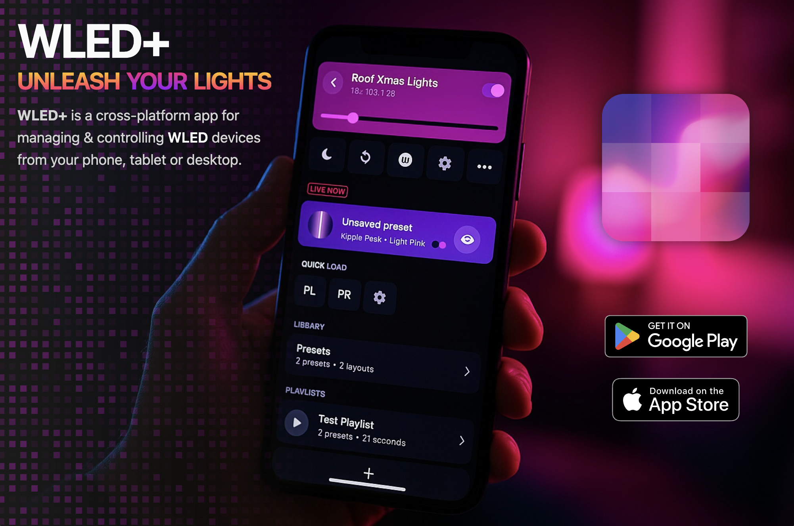

# WLED+

**WLED+** is a cross-platform app for managing & controlling [WLED](https://wled.app) devices from your phone, tablet or desktop.

## Latest Release

- :iphone: [App Store](https://apps.apple.com/us/app/wled/id6474789652) - iPhone - iPad - MacOS
- :arrow_forward: [Play Store](https://play.google.com/store/apps/details?id=com.pixelheart.wledplus) - Android
- :computer: [Direct Download](https://github.com/thepixelheart/wledplus-releases/releases/latest) - Android - MacOS

> For past releases, see [Release Archive](https://github.com/thepixelheart/wledplus-releases/releases).

## Supported Platforms

| **Platform** | **Version** |
| --- | --- |
| **✅ Android** | **7.0 and up** |
| **✅ iOS** | **14.0 and up** |
| **✅ macOS** | **Big Sur (11.0) and up** |
| Windows | *Planned…* |

*💌 If you are interested in other platforms, please [contact support](mailto:support@pixelheart.app).*

## Compatibility

| **Fork** | **Version** |
| --- | --- |
| **✅ [WLED](https://www.notion.so/fe262aa6ec294c419df1e5463a1504e0?pvs=21)**  | **0.13.3 and up** |
| **✅ [WLED SR](https://github.com/atuline/WLED)** | **0.13.3 and up** |
| **⚠️ [Moon Modules](https://github.com/MoonModules/WLED)** | *Best Effort* |

*⚠️ Devices running beta versions of WLED, custom forks or user mods might not function properly or some functionality might not be available.*

## Why WLED+

**WLED+** is developed by [Pixel Heart](https://pixelheart.ai) - a [1-person](https://x.com/tokudu) team in *Venice, CA*. **The goal of this project is to provide the WLED community with a more user-friendly alternative to the official WLED app** that relies strictly on the [JSON](https://kno.wled.ge/interfaces/json-api/) & [WebSocket](https://kno.wled.ge/interfaces/websocket/) APIs that WLED offers.

> The official WLED app and other alternatives rely on the browser to control your devices via the standard Web UI served directly from each controller. While the Web UI works well for basic tasks, its performance & capabilities are limited by the low-cost nature of the hardware that it runs on, and it can’t evolve without firmware updates.

While WLED+ is opinionated and closed-source, the name of the app was intentially chosen to be similar to WLED to help promote the project and maintain its brand. **WLED is awesome** and all credit for its development goes to [@aircookie](https://github.com/Aircoookie) and [other amazing contributors](https://kno.wled.ge/about/contributors/).

## WLED+ Features

**WLED+** offers a number of additional features compared to the official WLED app & other alternatives:

- **🗂️ Layout Management**
	- *Layouts* are unique segment configurations found across your saved presets.
	- You can switch between saved *Layouts* when creating new presets.
	- Segments within each *Layout* can be configure all together, as groups (sets) or individually
	- Creating new *Layouts* is easier thanks to a smarter strategy for adding new segments that automatically finds gaps in the layout or splits largest segments.
- 📚 **Library Management**
	- When creating new presets, you can immediately add them to a playlist.
	- Editing or creating playlists is much faster thanks to the improved UI.
	- When browsing presets, you can filter them by layout (ie: segment configuration) or sort them by recency, effect or palette.
- **📌 Quick Load Toolbar**
	- All presets marked for Quick Load can be managed in one place
- **🛠️ Lots of Smaller Usability Tweaks**

> 💡 **If you have ideas for other features you’d like to see in WLED+**, please [contact support](mailto:support@pixelheart.app) or submit feedback

## Support

If you running into a bug or have feature requests, you can submit feedback via the app or [create an issue](https://github.com/pixel-heart/wledplus/issues/new/choose) in this repo. You can also  [contact support](mailto:support@pixelheart.app) directly over email.

### Troubleshooting

- **My devices are not showing up in WLED+. Why?**
	1. Make sure you are connected to your WiFi.
	2. If you are using an *iPhone* or an *iPad*, make sure *Local Network Access* is enabled via Settings › Privacy & Security › WLED+
- **I’m unable to access my device in WLED+. What can I do?**
	1. Make sure your device is running a supported version of the WLED firmware (see above).
	2. If the version is supported , check that device is accessible via it's web interface and is functioning properly.
	3. Select **“Submit Bug Report”** in the device options to help us fix your issue in the next app release.
- **Does WLED+ collect any data?**
	- The app doesn’t require login or collect any personal data.
	- [Sentry](https://sentry.io) is used for crash reporting & user feedback.

### WLED Resources

- [WLED: Getting Started](https://kno.wled.ge/basics/getting-started/)
- [WLED: Common Issues](https://kno.wled.ge/basics/faq/)
- [WLED: Tutorials](https://kno.wled.ge/basics/tutorials/)
